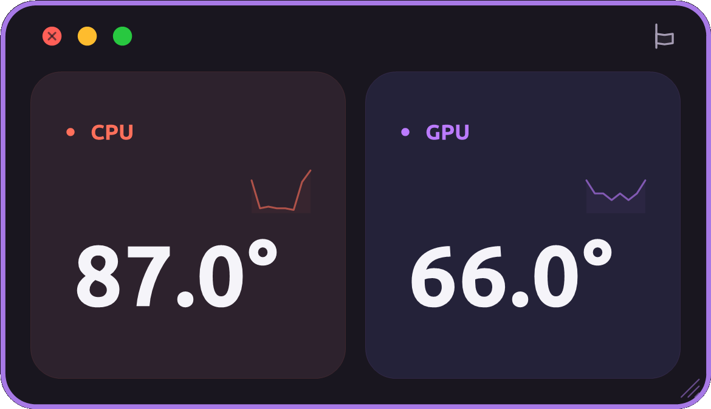
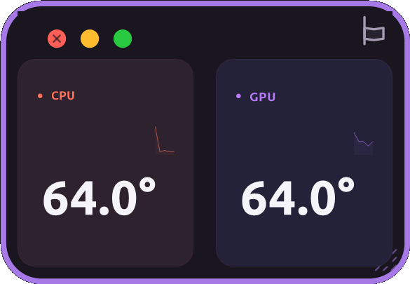
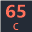
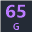
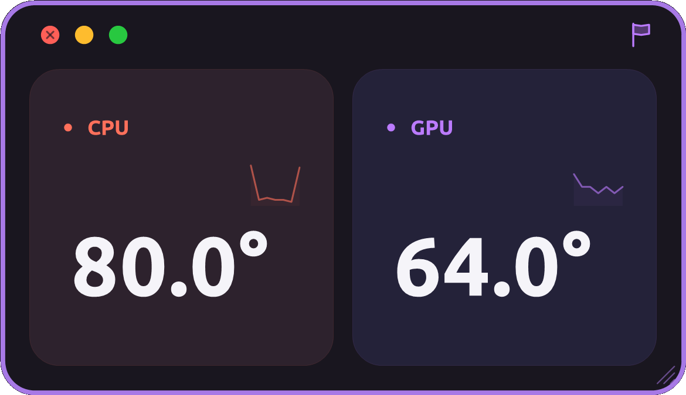
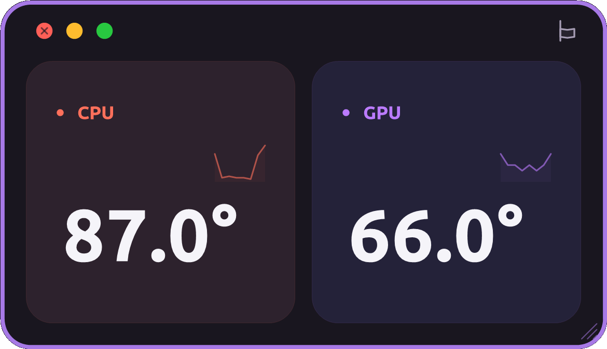

# SOY Temperature

**생생하게 PC의 온도를 체크합니다.**

현재는 **Windows 10/11 · x64**에서 사용할 수 있습니다. CPU·GPU 온도를 2초마다 확인하는 작은 데스크톱 모니터입니다.

## 다운로드

| 파일 | 링크 |
| --- | --- |
| 단일 실행 파일 | [SoyTemperature.exe 다운로드](https://github.com/soylab-edu/soylab_hw_temperature/releases/latest/download/SoyTemperature.exe) |
| `release/1.0.0` 폴더 ZIP | [Windows 배포 ZIP 다운로드](https://github.com/soylab-edu/soylab_hw_temperature/releases/latest/download/SoyTemperature-win-x64.zip) |
| 공개 소스 코드 | [소스 보기](https://github.com/soylab-edu/soylab_hw_temperature/tree/main) · [v1.0.7 소스 ZIP](https://github.com/soylab-edu/soylab_hw_temperature/archive/refs/tags/v1.0.7.zip) |

ZIP을 풀고 **`release/1.0.0/SoyTemperature.exe`**를 실행하세요. 실행 파일 하나에 .NET 런타임·아이콘·글꼴이 포함되어 있어 별도 .NET 설치가 필요 없습니다. 자동 실행에 사용할 고정된 위치에 보관하세요.

## 아이콘


SOYLAB 컬러 패턴과 커다란 온도계가 어우러진 아이콘입니다.

## 인터페이스



온도 숫자와 작은 그래프를 중심으로 구성했습니다. Ubuntu Bold 글꼴, 서로 다른 보라색 카드, 코랄·라벤더 그래프와 밝은 보라색 외곽선을 사용합니다. 이미지는 실제 PC에서 측정한 실행 화면이며, 온도는 사용 환경에 따라 달라집니다.

| 조작 | 동작 |
| --- | --- |
| 좌상단 빨간 버튼 | 종료 |
| 좌상단 노란 버튼 | 창을 숨기고 트레이에 CPU·GPU 온도 표시 |
| 좌상단 초록 버튼 | [소이랩 홈페이지](https://soylab.ai/) 열기 |
| 우상단 깃발 | **올라가면 로그인 시 자동 실행 ON**, 내려가면 OFF |
| 카드·여백 드래그 | 창 이동 |
| 가장자리·우하단 손잡이 드래그 | 창 크기 조절 |
| 트레이 온도 클릭 / 바로가기 재실행 | 기존 창 열기 |
| 창·트레이 우클릭 | 최저·최고 온도, 기록 초기화, CSV 저장, 드라이버 설치, 종료 |

창 크기와 화면 배율에 맞춰 글자·카드가 조절됩니다. 최소 크기는 논리 260×180 px입니다.



트레이에서도 2초마다 측정하며 최근 60초 그래프와 최저·최고 기록을 이어갑니다.

 

## 자동 실행과 바로가기

**우상단 깃발을 클릭하면** Windows 로그인 시 자동 실행을 켜거나 끌 수 있습니다. 올라간 깃발은 켜짐, 내려간 깃발은 꺼짐입니다. 켜면 현재 사용자용 예약 작업과 바탕 화면·시작 메뉴 바로가기를 만들고, 다음 로그인부터 창을 띄우지 않고 트레이로 시작합니다. CPU 센서에 필요한 관리자 권한으로 실행합니다.

 

작업 표시줄에 고정하려면 바탕 화면의 **SOY Temperature** 바로가기를 우클릭해 **작업 표시줄에 고정**을 선택하세요. 같은 앱을 다시 실행하면 중복으로 뜨지 않고 기존 창이 열립니다.

실행 파일 위치를 옮겼다면 새 위치에서 깃발을 다시 켜세요. 자동 실행을 끄더라도 지금 측정 중인 앱과 바로가기는 유지됩니다.

명령줄에서도 설정할 수 있습니다. 추가 설치 파일 없이 exe에 기능이 포함되어 있습니다.

```powershell
Start-Process .\SoyTemperature.exe -ArgumentList '--install-startup' -Wait  # 자동 실행 + 바로가기
Start-Process .\SoyTemperature.exe -ArgumentList '--remove-startup' -Wait   # 자동 실행 끄기
Start-Process .\SoyTemperature.exe -ArgumentList '--tray'                  # 트레이로 시작
```

## CPU 온도가 보이지 않을 때

실행할 때 Windows 관리자 승인 창에서 **예**를 누르세요. 다른 PC에 센서 드라이버가 없다면 우클릭 → **CPU 드라이버 설치**를 선택하세요. 공식 PawnIO 2.2.0 설치 파일의 SHA-256을 확인하고 설치합니다. 드라이버 설치에는 인터넷과 관리자 권한이 필요합니다. 하드웨어·드라이버에서 온도를 제공하지 않는 경우에는 `—`로 표시합니다.

## 공개 소스와 빌드

C# WinForms와 LibreHardwareMonitorLib 0.9.6을 사용합니다. 소스 코드와 빌드·배포 스크립트는 이 공개 저장소에 있습니다.

```powershell
powershell -ExecutionPolicy Bypass -File .\build.ps1
powershell -ExecutionPolicy Bypass -File .\launch.ps1
powershell -ExecutionPolicy Bypass -File .\package-release.ps1
```

SDK가 없다면 빌드 스크립트가 Microsoft 공식 설치 스크립트로 `.tools/dotnet`에 .NET 10 SDK를 설치합니다. 결과는 `release/1.0.0/SoyTemperature.exe`이며 ZIP에는 이 exe 하나만 넣습니다.

`--self-test`는 센서 기록·초기화를 검증합니다. `--tray --verify C:\Temp\SoyVerification --verify-exit`는 실제 측정, 트레이 시작·숨기기·복원, 작은 창 레이아웃과 크기 조절을 검증하고 캡처·보고서를 저장합니다. `--verify-startup-toggle`을 추가하면 실제 깃발 버튼을 두 번 눌러 설정을 바꾼 뒤 원래 설정으로 복구합니다. 오류 로그는 `%LOCALAPPDATA%/SoyTemperature/errors.log`에 있습니다.

참조: [LibreHardwareMonitor](https://github.com/LibreHardwareMonitor/LibreHardwareMonitor), [Microsoft 단일 파일 배포](https://learn.microsoft.com/en-us/dotnet/core/deploying/single-file/overview), [Windows 예약 작업](https://learn.microsoft.com/en-us/powershell/module/scheduledtasks/new-scheduledtaskprincipal), [Ubuntu 글꼴](https://design.ubuntu.com/font). 글꼴 라이선스는 앱 우클릭 메뉴와 [licenses](licenses)에서 볼 수 있습니다.

---

[소이랩 유튜브 채널](https://www.youtube.com/@soy_lab) · [생생정보통 채팅방](https://open.kakao.com/o/gs60FZgh) · [소이랩 홈페이지](https://soylab.ai/)
